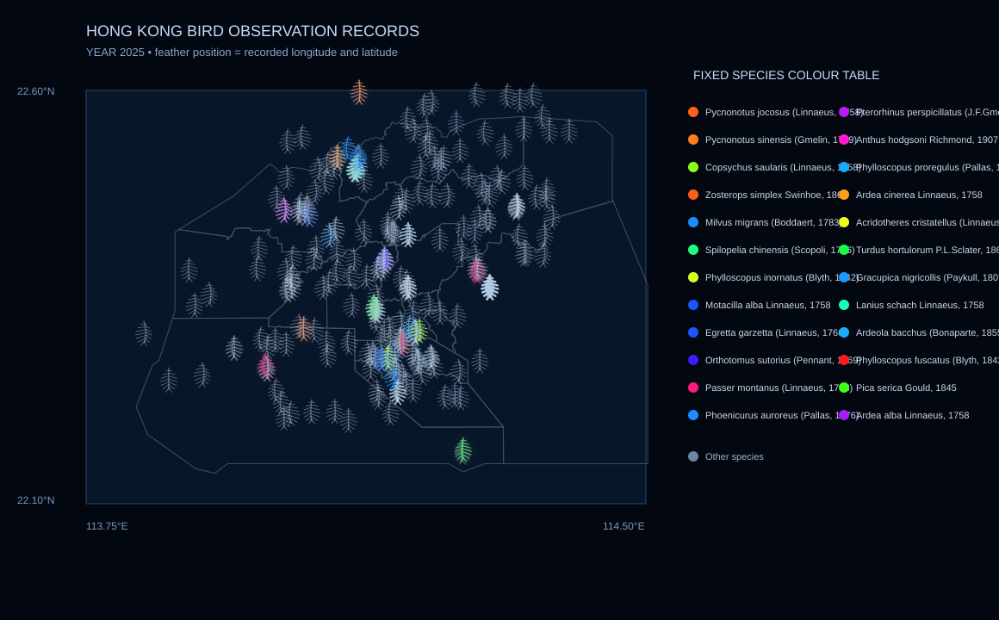

# Hong Kong Bird Observation Records, 1985–2025



## The Phenomenon

This project transforms bird observation records in Hong Kong from 1985 to 2025 into an interactive visualisation. I chose birds as the research subject because they are connected to natural environments, urban space, and human observation activities. I also wanted the final work to express the characteristics of birds visually, rather than only showing data. Therefore, I chose feathers as the main visual element.

This project does not claim to show the actual total number of birds in Hong Kong. Instead, it shows birds recorded by human observers and published by data organisations. Each feather represents one cached bird observation record. The location of each feather comes from the longitude and latitude in the original record.

## Data Source

Bird data comes from the [GBIF Occurrence Search API](https://api.gbif.org/v1/occurrence/search?class=Aves&country=HK&year=2025&hasCoordinate=true&hasGeospatialIssue=false&limit=300). I selected bird records (`class=Aves`) from Hong Kong (`country=HK`) with usable geographic coordinates, and requested data for each year from 1985 to 2025.

A maximum of 300 records is requested for each year. The original JSON responses are stored without modification in the `data/` folder, using the filename format `gbif-hong-kong-birds-YEAR.json`.

Each yearly JSON file contains up to 300 records. One record represents one published bird occurrence observation, and geographic coordinates are recorded as decimal degrees of longitude and latitude.

The `year` parameter is changed by `fetch.py` to request records from 1985 to 2025.

After the first download, the project can read the local cached data and run without an internet connection.

The grey Hong Kong map layer comes from the [Hong Kong Administrative Boundaries dataset](https://data.gov.hk/en-data/dataset/hk-had-json1-hong-kong-administrative-boundaries). The original boundary JSON file is saved as:

```text
data/hong-kong-boundary.geojson
```

## Visual System

The work uses a deep blue-black background. Hong Kong administrative boundaries are placed underneath all feathers and shown using thin grey lines.

The program transforms each bird record into an artistic feather shape. Each feather has a curved central shaft and small barbs branching on both sides. I did not use ordinary circular scatter-plot points because I wanted the visual form of the data to respond directly to the theme of birds.

The position of each feather comes from the longitude and latitude in the original record. The program converts the real geographic coordinates into screen positions in the web page.

A fixed “species–colour” legend is placed on the right side of the page. It lists the 24 bird species with the most records across the full period from 1985 to 2025. Each species uses the same base hue in every year. This design helps users compare data from different years.

In a selected year, focal bird species with more records use higher colour saturation. They also have a soft, low-opacity glow. Other bird species use low-saturation blue-grey colours and do not glow.

The program draws low-saturation feathers first and high-saturation feathers afterwards. Therefore, focal bird species naturally appear in the upper visual layer.

The feathers also have a slow breathing animation. This animation only changes the visual atmosphere of the work. It does not change the original geographic positions of the feathers.

The web page provides a year selection menu. Users can select any year from 1985 to 2025 and view the observation records for that year.

## What the Visualisation Shows

This visualisation shows the spatial distribution of cached bird observation records across Hong Kong. Because every feather is positioned using a real longitude and latitude, users can see where the available records appear in different parts of Hong Kong.

The fixed colour system also makes differences between bird species visible. The same bird species keeps the same base colour across different years, while higher saturation and soft glow highlight focal species with more records in the selected year.

The feather shape creates a visual connection to birds while preserving the geographic relationships in the source data.

## What the Visualisation Hides

Observation records are affected by birdwatching locations, the accessibility of a place, and whether different organisations publish their data. Therefore, more feathers do not necessarily mean that more birds actually live in that location.

This project uses a maximum of 300 API records per year. It shows a cached sample of published data, rather than all bird observation records in Hong Kong.

The grey map layer is an administrative boundary, not a detailed coastline, terrain map, or bird habitat map. If a small number of bird records appear outside the boundary, this may be caused by coordinate error or geographic uncertainty in the original data, rather than an error in the visualisation.

## How to Run

Run the following command first to download and cache the data:

```bash
uv run fetch.py
```

Then generate the visualisation:

```bash
uv run plot.py
```

After running the scripts, open the interactive visualisation in a browser:

```text
site/index.html
```

The static preview image is generated at:

```text
out/hong-kong-bird-records-2025.svg
```

After the data has been downloaded once, `plot.py` can read the cached files in `data/` and generate the visualisation offline.